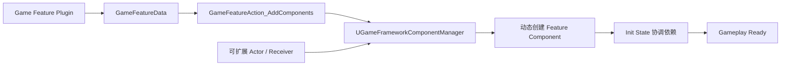
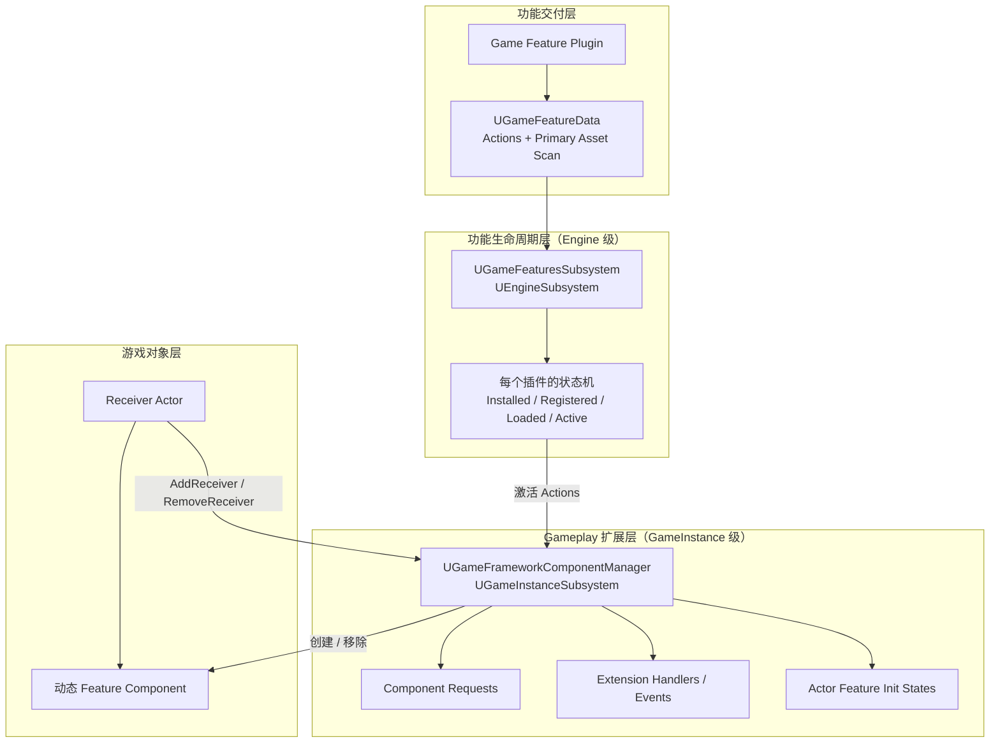
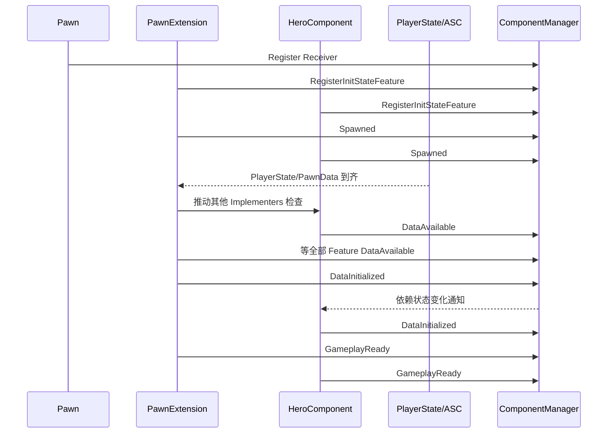

# UE5 Modular Gameplay 完整指南

> 文档定位：面向需要在 Unreal Engine 5 中设计可插拔玩法、Game Feature Plugin、动态组件扩展和多人游戏初始化流程的程序、技术策划与架构设计人员。
>
> 核对基线：Epic 官方 UE 5.8 在线文档与 API（访问/整理日期：2026-07-23）。UE5 各小版本的菜单、API 签名和 Beta/Experimental 标记可能不同，落地前应切换官方页面左上角到项目实际使用的引擎版本，并以本地引擎头文件为最终依据。

---

## 目录

- [1. 一页理解](#1-一页理解)
- [2. 名词、边界与适用场景](#2-名词边界与适用场景)
- [3. 总体设计结构](#3-总体设计结构)
- [4. 模块、插件和核心类型](#4-模块插件和核心类型)
- [5. Game Framework Component Manager](#5-game-framework-component-manager)
- [6. Extension Handler：动态扩展 Actor](#6-extension-handler动态扩展-actor)
- [7. Init State：解决跨组件初始化竞态](#7-init-state解决跨组件初始化竞态)
- [8. Game Feature Plugin](#8-game-feature-plugin)
- [9. 从零搭建：编辑器与 C++ 完整流程](#9-从零搭建编辑器与-c-完整流程)
- [10. C++ 用法与代码模板](#10-c-用法与代码模板)
- [11. Blueprint 使用方式](#11-blueprint-使用方式)
- [12. Lyra 的架构与可借鉴模式](#12-lyra-的架构与可借鉴模式)
- [13. 多人网络设计](#13-多人网络设计)
- [14. 依赖、资源、Cook、Chunk 与 DLC](#14-依赖资源cookchunk-与-dlc)
- [15. 自定义 Game Feature Action](#15-自定义-game-feature-action)
- [16. 推荐的项目分层](#16-推荐的项目分层)
- [17. 常见问题与排错](#17-常见问题与排错)
- [18. 性能、测试和上线检查表](#18-性能测试和上线检查表)
- [19. 版本差异与迁移注意](#19-版本差异与迁移注意)
- [20. API 速查](#20-api-速查)
- [21. 官方参考资料](#21-官方参考资料)

---

## 1. 一页理解

UE5 中通常所说的 **Modular Gameplay** 不是一个单独的“万能模块化系统”，而是两套相互配合的能力：

1. **Modular Gameplay 插件**：解决“运行时怎样扩展已经存在或未来生成的 Gameplay Framework Actor，以及多个组件怎样安全地完成初始化”。核心是 `UGameFrameworkComponentManager`。
2. **Game Features 插件**：解决“一个玩法功能如何作为插件被注册、加载、激活、停用和卸载”。核心是 `UGameFeaturesSubsystem`、`UGameFeatureData` 和 `UGameFeatureAction`。

最典型的数据流如下：



一句话概括：

> Game Features 决定“功能何时存在”，Modular Gameplay 决定“功能怎样接入 Actor 并安全变为可用”。

### 1.1 最重要的五条规则

1. **Actor 必须主动注册为 Receiver**，`Add Components` 不会神奇地修改任意 Actor。
2. **保存返回的 Request Handle**。组件请求和 Extension Handler 依靠 Handle 生命周期维持；Handle 被释放时，请求撤销，动态组件也会被移除。
3. **Extension Event 是瞬时事件，不保存历史**；需要“晚订阅仍能看到结果”时，应使用 Init State 或自己保存状态。
4. **Init State 是全局有序的初始化阶段，不是通用 Gameplay 状态机**；不要用它表达战斗、死亡、回合等可反复切换状态。
5. **Game Feature 激活不是网络复制**；服务器和客户端必须通过项目自己的会话/Experience 协议选择并激活一致的功能集合。

---

## 2. 名词、边界与适用场景

### 2.1 容易混淆的概念

| 概念 | 解决的问题 | 生命周期/粒度 | 是否可动态启停 |
|---|---|---|---|
| UE Module | C++ 编译与链接边界 | DLL/静态链接单元 | 一般不用于随玩法频繁启停 |
| 普通 UE Plugin | 代码与内容的交付/依赖边界 | 工程或引擎插件 | 通常在启动时启用 |
| Game Feature Plugin（GFP） | 独立玩法功能的注册、加载、激活、停用 | 可独立管理的功能插件 | 是 |
| Actor Component | 将行为与数据组合到 Actor | 单个 Actor 实例 | 可动态创建/销毁 |
| Modular Gameplay | Receiver、组件请求、扩展事件、初始化协调 | GameInstance + Actor | 是 |
| GAS | Ability、Effect、Attribute、Tag 等玩法执行模型 | Actor/Ability System | 能力可动态授予/回收 |
| Gameplay Tags | 稳定、可查询的语义标识 | 全局注册的标签 | 值可动态变化 |

Modular Gameplay 与 GAS 是互补关系而非替代关系：前者负责“把能力承载组件接到正确 Actor 上并协调初始化”，后者负责“能力如何授权、预测、执行、结算和复制”。

### 2.2 适合使用的场景

- 多个游戏模式共享核心角色，但按模式添加不同能力、输入、UI、计分和交互。
- 赛季、活动、DLC、可选内容或热更新式内容需要独立装载。
- 大型多人项目中，Pawn、PlayerState、Controller、Input、ASC 的复制到达顺序不固定，需要消除初始化竞态。
- 多团队并行开发，希望功能以插件边界隔离，减少主工程反向依赖。
- 需要对已经生成的 Actor 和未来生成的 Actor 应用相同扩展。
- 需要在 PIE、多 World、客户端/服务器环境中按上下文挂载不同逻辑。

### 2.3 不适合或不必使用的场景

- 很小且不会动态变化的单机项目，普通组件组合已经足够。
- 只想把代码分文件或加快编译：应先考虑普通 UE Module。
- 需要表达角色“Idle → Attack → Dead → Respawn”的循环状态：使用 Gameplay Tags、StateTree、GAS、动画状态机或项目状态机。
- 希望在运行时真正卸载任意含原生 C++ 类的模块并消除所有对象引用：这比“停用 Game Feature Action”复杂得多，不能把停用等同于彻底卸载代码。

---

## 3. 总体设计结构

### 3.1 四层架构



### 3.2 两个 Subsystem 为什么层级不同

- `UGameFeaturesSubsystem` 是 `UEngineSubsystem`：面向整个引擎进程管理 Feature Plugin 状态和插件 URL。
- `UGameFrameworkComponentManager` 是 `UGameInstanceSubsystem`：每个 GameInstance 都有自己的 Receiver、请求、Actor Feature 状态和 World 上下文，适合 PIE 多实例与客户端/服务器隔离。

因此自定义 Action 必须谨慎处理：**插件激活是 Engine 级概念，但具体组件注入通常要落到一个或多个 GameInstance/World**。

### 3.3 三种解耦通道

| 通道 | 特性 | 典型用途 |
|---|---|---|
| Component Request | 有状态、引用计数、作用于既有与未来 Receiver | 给 Pawn/Controller/GameState 添加功能组件 |
| Extension Event | 无状态、瞬时、只有当时已注册的 Handler 能收到 | “现在绑定输入”“Actor 已准备好”等握手事件 |
| Init State | 有状态、全局线性排序、可晚订阅立即回调 | 等待复制数据和跨组件依赖到齐 |

---

## 4. 模块、插件和核心类型

### 4.1 引擎自带 Modular Gameplay

路径通常为：

```text
Engine/Plugins/Runtime/ModularGameplay/
└─ Source/ModularGameplay/
   ├─ Public/Components/
   └─ Private/Components/
```

核心类型：

| 类型 | 作用 |
|---|---|
| `UGameFrameworkComponentManager` | Receiver、组件请求、扩展事件、Actor Feature Init State 的中心管理器 |
| `FComponentRequestHandle` | 维持组件请求或 Handler 注册的 RAII/引用生命周期 |
| `UGameFrameworkComponent` | 面向 Gameplay Framework Actor 的基础组件 |
| `UControllerComponent` | 面向 `AController`，提供 Controller/PlayerController 常用访问和事件入口 |
| `UGameStateComponent` | 面向 `AGameStateBase` |
| `UPawnComponent` | 面向 `APawn`，提供 Pawn/Controller/PlayerState 等访问 |
| `UPlayerStateComponent` | 面向 `APlayerState` |
| `UGameFrameworkInitStateInterface` / `IGameFrameworkInitStateInterface` | 简化 Init State 接入的接口 |
| `FActorInitStateChangedParams` | Init State 变化回调参数 |
| `EGameFrameworkAddComponentFlags` | 控制动态组件创建策略 |

官方 API 总览：[ModularGameplay module](https://dev.epicgames.com/documentation/en-us/unreal-engine/API/Plugins/ModularGameplay)。

### 4.2 引擎自带 Game Features

路径通常为：

```text
Engine/Plugins/Runtime/GameFeatures/
└─ Source/
   ├─ GameFeatures/
   └─ GameFeaturesEditor/
```

核心类型：

| 类型 | 作用 |
|---|---|
| `UGameFeaturesSubsystem` | Engine 级 Feature Plugin 管理器 |
| `UGameFeatureData` | 一个 Feature 的 Actions 和要扫描的 Primary Asset 类型 |
| `UGameFeatureAction` | 注册、加载、激活、停用、卸载阶段的可扩展操作基类 |
| `UGameFeatureAction_AddComponents` | 激活后向 Component Manager 提交 Actor→Component 请求 |
| `FGameFeatureComponentEntry` | ActorClass、ComponentClass、客户端/服务器标记和 AdditionFlags |
| `UGameFeatureAction_AddCheats` | 注册 Cheat Manager Extension；Shipping 中无 Cheat Manager |
| `UGameFeatureAction_DataRegistry` | 增加 Data Registry |
| `UGameFeatureAction_DataRegistrySource` | 向 Registry 增加数据源 |
| `UGameFeatureAction_AddWorldPartitionContent` | 增加 World Partition/External Data Layer 内容 |
| `UGameFeaturesProjectPolicies` | 项目级 Feature 发现、许可和启动策略扩展点 |

`UGameFeatureData` 继承 `UPrimaryDataAsset`，因此与 Asset Manager、Asset Bundle、Cook/Chunk 管理天然相连。参见 [UGameFeatureData API](https://dev.epicgames.com/documentation/en-us/unreal-engine/API/Plugins/GameFeatures/UGameFeatureData)。

### 4.3 Lyra 的 ModularGameplayActors 不是通用引擎基类

Lyra 使用了一个项目/示例插件 `ModularGameplayActors`，其中常见类型包括：

- `AModularCharacter`
- `AModularPawn`
- `AModularPlayerController`
- `AModularAIController`
- `AModularPlayerState`
- `AModularGameModeBase` / `AModularGameMode`
- `AModularGameStateBase` / `AModularGameState`

它们的主要价值是把 Receiver 注册、移除以及部分 Gameplay Framework 事件转发做成可复用基类。**空白 UE 工程不应假定这些类存在**。可选方案：

1. 从与项目引擎版本匹配的 Lyra 中迁移该插件并维护它；
2. 在项目自己的 Actor 基类中实现几行 Receiver 注册代码；
3. 只对确实需要扩展的 Actor 做最小接入。

通常方案 2 最透明、依赖最少。

---

## 5. Game Framework Component Manager

### 5.1 管理器内部维护什么

从公开 API 和数据结构可将其理解为四张核心索引：

- Receiver Class → 需要创建的 Component Class 请求集合。
- Receiver Class → Extension Handler 集合。
- Component Class → 由管理器创建的实例集合。
- Actor → 多个 Feature 的 Implementer、当前 Init State 和委托。

组件请求是**引用计数**的。同一 Actor Class + Component Class 被多方请求时，不会因为其中一方撤销就过早移除；最后一个请求释放后才移除对应动态组件。官方 API 对这一点有明确说明：[UGameFrameworkComponentManager](https://dev.epicgames.com/documentation/en-us/unreal-engine/API/Plugins/ModularGameplay/UGameFrameworkComponentManager)。

### 5.2 时间顺序无关性

系统同时处理两种顺序：

1. **先有请求，后 Spawn Actor**：Actor 调用 `AddReceiver` 时匹配已有请求并创建组件。
2. **先有 Actor，后激活 Feature**：新增请求时扫描已注册 Receiver，并给匹配 Actor 创建组件。

这是它比在 GameMode 中手动遍历 Actor 更可靠的核心原因。

### 5.3 Actor Class 匹配

- 请求针对一个 Receiver 基类，派生类实例可匹配。
- 官方明确说明把 `AActor` 作为 `Add Components` 的 Actor Class 不受支持，会被忽略。
- 应使用满足需求的**最窄公共父类**。
- 多个目标类没有合适公共父类时，配置多条 Entry，不要上提到 `AActor`。

### 5.4 Receiver 注册的最佳生命周期

官方概览页的简化示例曾在 `BeginPlay` 中调用 `AddReceiver`，而 Component Manager 专页建议：

- `PreInitializeComponents`：`AddGameFrameworkComponentReceiver`
- `EndPlay`：`RemoveGameFrameworkComponentReceiver`

项目实践建议采用后一组对称生命周期。原因是它注册更早，动态组件有机会参与正常组件初始化；同时 `EndPlay` 能明确移除并触发清理。详见 [Game Framework Component Manager](https://dev.epicgames.com/documentation/en-us/unreal-engine/game-framework-component-manager-in-unreal-engine)。

```cpp
// MyExtensibleCharacter.cpp
#include "Components/GameFrameworkComponentManager.h"

void AMyExtensibleCharacter::PreInitializeComponents()
{
    Super::PreInitializeComponents();
    UGameFrameworkComponentManager::AddGameFrameworkComponentReceiver(this);
}

void AMyExtensibleCharacter::EndPlay(const EEndPlayReason::Type EndPlayReason)
{
    UGameFrameworkComponentManager::RemoveGameFrameworkComponentReceiver(this);
    Super::EndPlay(EndPlayReason);
}
```

注意：

- 必须调用 `Super`。
- Add/Remove 必须对称；否则 PIE、Travel、Actor 重生和 Feature 重激活时容易留下错误状态。
- 如果 CDO/编辑器预览 World 不应接入，使用 API 的 `bAddOnlyInGameWorlds` 选项或静态辅助函数默认策略。
- 不要在构造函数中依赖 GameInstance Subsystem，此时 World/GameInstance 往往尚未建立。

---

## 6. Extension Handler：动态扩展 Actor

### 6.1 `AddComponentRequest`

直接 C++ 请求的基本模式：

```cpp
TSharedPtr<FComponentRequestHandle> ComponentRequestHandle;

void UMyRuntimeFeatureOwner::Activate(UGameInstance* GameInstance)
{
    if (UGameFrameworkComponentManager* Manager =
        GameInstance->GetSubsystem<UGameFrameworkComponentManager>())
    {
        ComponentRequestHandle = Manager->AddComponentRequest(
            AMyExtensibleCharacter::StaticClass(),
            UMyFeatureComponent::StaticClass(),
            EGameFrameworkAddComponentFlags::AddUnique);
    }
}

void UMyRuntimeFeatureOwner::Deactivate()
{
    // 最后一个相同请求释放后，管理器创建的组件会被移除。
    ComponentRequestHandle.Reset();
}
```

生产代码中 Handle 通常按 `GameInstance`、激活上下文或 World 分组保存，不能仅保存一个全局 Handle，否则多 PIE/多 World 时容易相互覆盖。

### 6.2 Addition Flags

`EGameFrameworkAddComponentFlags`：

| 标记 | 含义 |
|---|---|
| `None` | 不做额外去重规则，每次按请求策略创建 |
| `AddUnique` | Actor 上已经存在完全相同的 `ComponentClass` 时不再添加 |
| `AddIfNotChild` | Actor 上已有该类的派生组件时也不添加 |
| `UseAutoGeneratedName` | 使用自动生成的实例名，避免固定类名导致组件回收/重用问题 |

`AddUnique` 与 `AddIfNotChild` 的差别很重要：若 Actor 上已经有 `UMyAdvancedHealthComponent : UMyHealthComponent`，请求 `UMyHealthComponent` 时，`AddIfNotChild` 可避免再创建一个基础版本。官方枚举说明见 [EGameFrameworkAddComponentFlags](https://dev.epicgames.com/documentation/en-us/unreal-engine/API/Plugins/ModularGameplay/EGameFrameworkAddComponentFlags)。

### 6.3 Extension Handler

`AddExtensionHandler` 不一定创建组件，而是监听某个 Actor Class 的 Receiver/扩展事件：

```cpp
TSharedPtr<FComponentRequestHandle> ExtensionHandlerHandle;

ExtensionHandlerHandle = Manager->AddExtensionHandler(
    AMyExtensibleCharacter::StaticClass(),
    UGameFrameworkComponentManager::FExtensionHandlerDelegate::CreateUObject(
        this, &ThisClass::HandleCharacterExtension));

void UMyExtensionOwner::HandleCharacterExtension(AActor* Actor, FName EventName)
{
    if (EventName == UGameFrameworkComponentManager::NAME_ExtensionAdded ||
        EventName == UGameFrameworkComponentManager::NAME_ReceiverAdded)
    {
        // 建立绑定；代码应幂等。
    }
    else if (EventName == UGameFrameworkComponentManager::NAME_ExtensionRemoved ||
             EventName == UGameFrameworkComponentManager::NAME_ReceiverRemoved)
    {
        // 解除绑定、撤销输入、清除 UI 等。
    }
}
```

内置常量包括：

- `NAME_ReceiverAdded`
- `NAME_ReceiverRemoved`
- `NAME_ExtensionAdded`
- `NAME_ExtensionRemoved`
- `NAME_GameActorReady`

也可以使用项目自定义 `FName` 事件，例如 Lyra 的 `NAME_BindInputsNow`。

### 6.4 发送瞬时扩展事件

```cpp
static const FName NAME_BindFeatureInput(TEXT("BindFeatureInputNow"));

UGameFrameworkComponentManager::SendGameFrameworkComponentExtensionEvent(
    GetOwner(), NAME_BindFeatureInput);
```

关键语义：

- 事件不缓存；发送时没有 Handler，之后注册的 Handler 不会补收。
- Handler 必须同时处理“已存在 Actor 在 Handler 注册后收到 `ExtensionAdded`”以及自定义事件。
- 每个绑定操作都应可重复执行且不产生重复 Delegate/Input Mapping。
- 在 `ExtensionRemoved` / `ReceiverRemoved` 和 Feature Deactivation 中做对称撤销。

如果消费者必须晚到也能判断“已经 Ready”，改用 Init State、Gameplay Tag 或持久属性。

---

## 7. Init State：解决跨组件初始化竞态

### 7.1 为什么需要 Init State

多人游戏中的典型不确定顺序：

- Pawn 已 Spawn，但 Controller 尚未 Possess。
- Pawn 的 `PlayerState` 在客户端尚未复制到。
- PawnData/Experience 已选择，但软资源仍在异步加载。
- ASC 位于 PlayerState，Avatar Actor 是 Pawn，两者尚未完成关联。
- Enhanced Input Component 只存在于本地玩家且尚未创建。
- Game Feature 后激活，组件在 Actor BeginPlay 后才动态加入。

使用“Delay 0.2 秒”无法证明依赖已满足，而且会随网络、机器与帧率变化产生随机 Bug。Init State 将“时间猜测”替换为“条件检查 + 状态通知”。

### 7.2 数据模型

```text
一个 Actor
├─ Feature: PawnExtension  -> InitState.DataInitialized
├─ Feature: HeroInput      -> InitState.DataAvailable
├─ Feature: Health         -> InitState.GameplayReady
└─ Feature: Inventory      -> InitState.Spawned
```

- **FeatureName**：`FName`，在同一 Actor 内唯一标识一个功能实现者。
- **Implementer**：通常是 Component，也可以是其他 UObject。
- **Init State**：`FGameplayTag`。
- **全局顺序**：由每个 GameInstance 的 Component Manager 注册，所有 Actor 共用同一条线性顺序。

### 7.3 它不是通用状态机

Init State 的设计是“从未初始化单调前进到可用”。它不适合：

- Ready → Dead → Ready；
- Menu → Match → Results；
- Weapon.Holstered ↔ Weapon.Equipped；
- 任意分支、并行或回退流程。

这些状态应使用专门状态机或 Gameplay Tags。Init State 只负责对象/功能初始化。

### 7.4 注册全局状态顺序

可在自定义 `UGameInstance::Init` 或等价的项目启动位置中注册。以下采用 Lyra 的四阶段语义：

```cpp
void UMyGameInstance::Init()
{
    Super::Init();

    if (UGameFrameworkComponentManager* Manager =
        GetSubsystem<UGameFrameworkComponentManager>())
    {
        Manager->RegisterInitState(TAG_InitState_Spawned, false, FGameplayTag());
        Manager->RegisterInitState(TAG_InitState_DataAvailable, false, TAG_InitState_Spawned);
        Manager->RegisterInitState(TAG_InitState_DataInitialized, false, TAG_InitState_DataAvailable);
        Manager->RegisterInitState(TAG_InitState_GameplayReady, false, TAG_InitState_DataInitialized);
    }
}
```

`RegisterInitState(NewState, bAddBefore, ExistingState)` 允许相对已有状态插入。顺序必须稳定，不能由加载顺序不确定的多个插件随意互相插入，否则“Reached or Later”的比较语义会变得不可预测。

### 7.5 Lyra 四阶段语义

| 状态 | 推荐含义 |
|---|---|
| `InitState.Spawned` | 对象已 Spawn，组件完成基础注册，开始进入游戏生命周期 |
| `InitState.DataAvailable` | 本功能所需的复制引用、配置和异步数据已经可读取 |
| `InitState.DataInitialized` | 已使用数据完成一次性配置，例如初始化 ASC、授予能力、创建输入绑定 |
| `InitState.GameplayReady` | 初始化全部完成，正常玩法可以安全交互 |

Epic 说明：Lyra 5.0 早于这套 Init State，5.1 及之后的 Lyra 才是应参考的实现。详见 [Game Framework Component Manager — Lyra Example](https://dev.epicgames.com/documentation/en-us/unreal-engine/game-framework-component-manager-in-unreal-engine)。

### 7.6 组件接入约定

实现 `IGameFrameworkInitStateInterface` 的组件通常遵循：

1. `OnRegister`：`RegisterInitStateFeature()`。
2. `BeginPlay`：监听依赖 Feature 的变化，然后 `CheckDefaultInitialization()`。
3. 每个关键 `OnRep_*`、Possess/UnPossess、PlayerState 变化、异步加载回调：再次 `CheckDefaultInitialization()`。
4. `CanChangeInitState`：只检查进入目标阶段的前置条件，不做副作用。
5. `HandleChangeInitState`：执行该跃迁的一次性副作用。
6. `EndPlay`：`UnregisterInitStateFeature()`。

### 7.7 协调其他 Feature

中心协调组件常采用：

```cpp
CheckDefaultInitializationForImplementers();

const bool bOthersReady = Manager->HaveAllFeaturesReachedInitState(
    GetOwningActor(),
    TAG_InitState_DataAvailable,
    GetFeatureName());
```

这样 PawnExtension 可以先推动同 Actor 上的 Hero/Input/Health 等 Feature，再等待它们全部达到 `DataAvailable`，最后统一进入 `DataInitialized`。

### 7.8 监听状态，避免丢事件

`RegisterAndCallForActorInitState` 和 `RegisterAndCallForClassInitState` 的 `bCallImmediately=true` 很重要：如果订阅时目标已经达到要求状态，会立即回调。它提供了 Extension Event 不具备的“晚订阅安全”。

---

## 8. Game Feature Plugin

### 8.1 目标状态

公开的 `EGameFeatureTargetState` 有四个主要目标：

```text
Installed → Registered → Loaded → Active
```

| 目标状态 | 概念说明 |
|---|---|
| `Installed` | 插件数据已在磁盘/安装介质可用 |
| `Registered` | 插件与 `GameFeatureData` 已登记，相关 Primary Assets 可进入发现体系 |
| `Loaded` | 代码/资源已加载到可激活状态，但玩法 Action 尚未应用 |
| `Active` | Actions 已应用到相应上下文，功能正在生效 |

内部状态机还有检查、下载、安装、挂载、卸载、错误等过渡状态；业务代码应面向公开目标和异步完成结果，不要依赖内部过渡枚举。公开目标枚举见 [EGameFeatureTargetState](https://dev.epicgames.com/documentation/en-us/unreal-engine/API/Plugins/GameFeatures/EGameFeatureTargetState)。

### 8.2 `UGameFeatureAction` 生命周期

| 回调 | 适合做什么 |
|---|---|
| `OnGameFeatureRegistering` | 注册数据类型、全局定义；即使从未 Active 也可能调用 |
| `OnGameFeatureLoading` | 为近期激活准备/加载 |
| `OnGameFeatureActivating(Context)` | 对匹配上下文创建请求、注册 Handler、应用功能 |
| `OnGameFeatureActivated` | Feature 已完全 Active 后通知 |
| `OnGameFeatureDeactivating(Context)` | 撤销功能；必要时暂停异步 Deactivation |
| `OnGameFeatureUnloading` | 释放加载阶段资源 |
| `OnGameFeatureUnregistering` | 撤销注册阶段内容，不会在重新注册前再次激活 |

官方 API 特别说明：`OnGameFeatureDeactivating` 后可能很快再次激活，因此“停用”和“永久销毁”不能混为一谈。参见 [UGameFeatureAction](https://dev.epicgames.com/documentation/en-us/unreal-engine/API/Plugins/GameFeatures/UGameFeatureAction)。

### 8.3 停用可异步等待

如果需要等待异步存档、动画退出或资源释放：

```cpp
FSimpleDelegate Resume = Context.PauseDeactivationUntilComplete(TEXT("MyActionCleanup"));

// 异步任务完成后，必须在 Game Thread 调用：
Resume.ExecuteIfBound();
```

不要忘记执行 Resume，否则状态机会永久卡在 Deactivating。API 见 [FGameFeatureDeactivatingContext](https://dev.epicgames.com/documentation/en-us/unreal-engine/API/Plugins/GameFeatures/FGameFeatureDeactivatingContext)。

### 8.4 内置启动策略

默认 `UDefaultGameFeaturesProjectPolicies` 会按照插件描述中的自动注册、加载、激活设置处理内置 GFP；项目也可继承 `UGameFeaturesProjectPolicies` 并在 **Project Settings → Game Features** 指定，以实现平台、权限、版本、DLC、服务器类型或体验选择策略。

不要让所有 Feature 默认 Active：

- 基础且任何模式都需要的功能可以开机 Active。
- 菜单需要发现但不执行的内容可 Registered/Loaded。
- 模式、地图、赛季内容由 Experience/会话流程按需 Active。

### 8.5 动态激活 API

```cpp
#include "GameFeaturesSubsystem.h"

UGameFeaturesSubsystem::Get().LoadAndActivateGameFeaturePlugin(
    PluginURL,
    FGameFeaturePluginLoadComplete::CreateLambda(
        [](const UE::GameFeatures::FResult& Result)
        {
            if (Result.HasError())
            {
                // 记录 Result 的错误码/文本；不要假定成功。
            }
        }));
```

配对接口包括：

- `DeactivateGameFeaturePlugin`：目标回到 Loaded；
- `UnloadGameFeaturePlugin`：进一步释放加载数据；
- `ReleaseGameFeaturePlugin`：释放 Feature 数据但不从磁盘卸载；
- `ChangeGameFeatureTargetState`：显式指定目标状态；
- `GetPluginState`：查询状态。

API 见 [UGameFeaturesSubsystem](https://dev.epicgames.com/documentation/en-us/unreal-engine/API/Plugins/GameFeatures/UGameFeaturesSubsystem) 和 [LoadAndActivateGameFeaturePlugin](https://dev.epicgames.com/documentation/en-us/unreal-engine/API/Plugins/GameFeatures/UGameFeaturesSubsystem/LoadAndActivateGameFeaturePlugin)。

---

## 9. 从零搭建：编辑器与 C++ 完整流程

以下示例目标：创建一个 `DashFeature`，激活后给 `AMyGameCharacter` 添加 `UDashFeatureComponent`。

### 9.1 启用插件

1. **Edit → Plugins**。
2. 搜索并启用 **Game Features** 与 **Modular Gameplay**。
3. 按提示重启编辑器。
4. 若要集成 GAS，再启用 Gameplay Abilities；不要仅为了 Modular Gameplay 强制引入 GAS。

### 9.2 让目标 Actor 可扩展

在项目基础角色中加入上一节的 `PreInitializeComponents` / `EndPlay` 对称注册。若目标是 PlayerState、GameState、Controller，同理在对应项目基类中接入。

### 9.3 创建 Feature Plugin

1. **Edit → Plugins → Add**。
2. 选择 **Game Feature (Content Only)** 或相应带代码模板。
3. 名称设为 `DashFeature`。
4. 确认位于：

```text
ProjectRoot/Plugins/GameFeatures/DashFeature/
```

5. 打开 Content Browser 的 **Show Plugin Content**。
6. 在插件内容根目录创建 `GameFeatureData`，通常命名为 `DashFeature`。

官方说明首次新建 `GameFeatureData` 后如果 Action 不工作，可能需要重启一次编辑器；后续修改一般不需要。完整步骤见 [Game Features and Modular Gameplay](https://dev.epicgames.com/documentation/en-us/unreal-engine/game-features-and-modular-gameplay-in-unreal-engine)。

### 9.4 创建 Feature Component

组件应放在 Feature Plugin 自己的模块/内容中，并尽量包含该功能的全部状态与行为：

```cpp
UCLASS(ClassGroup=(GameFeature), BlueprintType, Blueprintable,
       meta=(BlueprintSpawnableComponent))
class DASHFEATURE_API UDashFeatureComponent : public UPawnComponent
{
    GENERATED_BODY()

public:
    UDashFeatureComponent(const FObjectInitializer& ObjectInitializer);

protected:
    virtual void BeginPlay() override;
    virtual void EndPlay(const EEndPlayReason::Type EndPlayReason) override;
};
```

若该组件要复制：

```cpp
UDashFeatureComponent::UDashFeatureComponent(const FObjectInitializer& ObjectInitializer)
    : Super(ObjectInitializer)
{
    SetIsReplicatedByDefault(true);
    PrimaryComponentTick.bCanEverTick = false;
}
```

是否复制取决于数据归属。仅本地输入/UI 组件不应为了“方便”开启复制。

### 9.5 配置 Add Components Action

打开 `DashFeature` 的 `GameFeatureData`：

1. Actions 数组增加 **Add Components**。
2. Component List 增加一项。
3. Actor Class：`AMyGameCharacter` 或其最窄公共基类。
4. Component Class：`UDashFeatureComponent` 或其 Blueprint 子类。
5. 根据逻辑勾选 Client/Server。
6. Addition Flags 通常从 `AddUnique` 开始。

### 9.6 设置并测试 Feature 状态

- 在插件/Game Feature 管理界面将 Feature 激活，或通过项目 Experience 流程激活。
- PIE 前后测试两种顺序：先有 Feature 后 Spawn；先 Spawn 再激活 Feature。
- 停用时确认组件、输入、Delegate、Widget、Ability 全部移除。
- 再次激活，确认没有重复绑定。

### 9.7 C++ 模块依赖

宿主模块仅接 Receiver 时，`.Build.cs` 常见依赖：

```csharp
PublicDependencyModuleNames.AddRange(new string[]
{
    "Core",
    "CoreUObject",
    "Engine",
    "GameplayTags",
    "ModularGameplay"
});
```

自定义 Game Feature Action 的模块再加入：

```csharp
PrivateDependencyModuleNames.AddRange(new string[]
{
    "GameFeatures"
});
```

若公共头文件暴露了某模块类型，就应放入 `PublicDependencyModuleNames`；仅 `.cpp` 使用则优先 Private。

### 9.8 `.uplugin` 示例（以模板生成结果为准）

```json
{
  "FileVersion": 3,
  "Version": 1,
  "VersionName": "1.0",
  "FriendlyName": "Dash Feature",
  "Category": "Game Features",
  "CanContainContent": true,
  "ExplicitlyLoaded": true,
  "BuiltInInitialFeatureState": "Registered",
  "Modules": [
    {
      "Name": "DashFeature",
      "Type": "Runtime",
      "LoadingPhase": "Default"
    }
  ],
  "Plugins": [
    { "Name": "GameFeatures", "Enabled": true },
    { "Name": "ModularGameplay", "Enabled": true }
  ]
}
```

字段会随版本与模板变化，尤其是初始状态/显式加载设置。最安全的做法是由当前引擎版本的 Game Feature Wizard 生成，再做最小修改。

---

## 10. C++ 用法与代码模板

### 10.1 完整的 Init State Feature 组件骨架

以下是结构模板，项目需替换 API 导出宏、Tag 定义和数据条件：

```cpp
// MyPawnFeatureComponent.h
#pragma once

#include "Components/PawnComponent.h"
#include "Components/GameFrameworkInitStateInterface.h"
#include "MyPawnFeatureComponent.generated.h"

UCLASS(Blueprintable, meta=(BlueprintSpawnableComponent))
class MYGAME_API UMyPawnFeatureComponent
    : public UPawnComponent
    , public IGameFrameworkInitStateInterface
{
    GENERATED_BODY()

public:
    virtual FName GetFeatureName() const override;
    virtual bool CanChangeInitState(
        UGameFrameworkComponentManager* Manager,
        FGameplayTag CurrentState,
        FGameplayTag DesiredState) const override;
    virtual void HandleChangeInitState(
        UGameFrameworkComponentManager* Manager,
        FGameplayTag CurrentState,
        FGameplayTag DesiredState) override;
    virtual void CheckDefaultInitialization() override;
    virtual void OnActorInitStateChanged(
        const FActorInitStateChangedParams& Params) override;

protected:
    virtual void OnRegister() override;
    virtual void BeginPlay() override;
    virtual void EndPlay(const EEndPlayReason::Type EndPlayReason) override;

    bool IsRequiredDataAvailable() const;
    bool bRuntimeBindingsCreated = false;
};
```

```cpp
// MyPawnFeatureComponent.cpp
#include "MyPawnFeatureComponent.h"
#include "Components/GameFrameworkComponentManager.h"
#include "MyInitStateTags.h"

namespace MyPawnFeature
{
    static const FName NAME_ActorFeature(TEXT("MyPawnFeature"));
}

FName UMyPawnFeatureComponent::GetFeatureName() const
{
    return MyPawnFeature::NAME_ActorFeature;
}

void UMyPawnFeatureComponent::OnRegister()
{
    Super::OnRegister();
    RegisterInitStateFeature();
}

void UMyPawnFeatureComponent::BeginPlay()
{
    Super::BeginPlay();

    // 依赖另一个 Feature 时监听它；RequiredState 为空可监听全部变化。
    BindOnActorInitStateChanged(
        TEXT("PawnExtension"),
        FGameplayTag(),
        false);

    CheckDefaultInitialization();
}

void UMyPawnFeatureComponent::EndPlay(const EEndPlayReason::Type EndPlayReason)
{
    // 先撤销本组件建立的外部绑定/能力/输入，再注销状态。
    bRuntimeBindingsCreated = false;
    UnregisterInitStateFeature();
    Super::EndPlay(EndPlayReason);
}

bool UMyPawnFeatureComponent::CanChangeInitState(
    UGameFrameworkComponentManager* Manager,
    FGameplayTag CurrentState,
    FGameplayTag DesiredState) const
{
    if (!CurrentState.IsValid() && DesiredState == TAG_InitState_Spawned)
    {
        return GetPawn<APawn>() != nullptr;
    }

    if (CurrentState == TAG_InitState_Spawned &&
        DesiredState == TAG_InitState_DataAvailable)
    {
        return IsRequiredDataAvailable();
    }

    if (CurrentState == TAG_InitState_DataAvailable &&
        DesiredState == TAG_InitState_DataInitialized)
    {
        return Manager->HasFeatureReachedInitState(
            GetOwningActor(),
            TEXT("PawnExtension"),
            TAG_InitState_DataInitialized);
    }

    if (CurrentState == TAG_InitState_DataInitialized &&
        DesiredState == TAG_InitState_GameplayReady)
    {
        return true;
    }

    return false;
}

void UMyPawnFeatureComponent::HandleChangeInitState(
    UGameFrameworkComponentManager* Manager,
    FGameplayTag CurrentState,
    FGameplayTag DesiredState)
{
    if (DesiredState == TAG_InitState_DataInitialized && !bRuntimeBindingsCreated)
    {
        // 在这里执行一次性初始化：绑定输入、授予能力、初始化数据等。
        bRuntimeBindingsCreated = true;
    }
}

void UMyPawnFeatureComponent::CheckDefaultInitialization()
{
    static const TArray<FGameplayTag> StateChain =
    {
        TAG_InitState_Spawned,
        TAG_InitState_DataAvailable,
        TAG_InitState_DataInitialized,
        TAG_InitState_GameplayReady
    };

    ContinueInitStateChain(StateChain);
}

void UMyPawnFeatureComponent::OnActorInitStateChanged(
    const FActorInitStateChangedParams& Params)
{
    CheckDefaultInitialization();
}
```

应在所有可能让 `IsRequiredDataAvailable()` 从 false 变 true 的位置调用 `CheckDefaultInitialization()`：

```cpp
void UMyPawnFeatureComponent::OnRep_ConfigData()
{
    CheckDefaultInitialization();
}

void UMyPawnFeatureComponent::HandleControllerChanged()
{
    CheckDefaultInitialization();
}

void UMyPawnFeatureComponent::OnAsyncAssetLoaded()
{
    CheckDefaultInitialization();
}
```

### 10.2 Native Gameplay Tags 定义

```cpp
// MyInitStateTags.h
#pragma once
#include "NativeGameplayTags.h"

UE_DECLARE_GAMEPLAY_TAG_EXTERN(TAG_InitState_Spawned);
UE_DECLARE_GAMEPLAY_TAG_EXTERN(TAG_InitState_DataAvailable);
UE_DECLARE_GAMEPLAY_TAG_EXTERN(TAG_InitState_DataInitialized);
UE_DECLARE_GAMEPLAY_TAG_EXTERN(TAG_InitState_GameplayReady);
```

```cpp
// MyInitStateTags.cpp
#include "MyInitStateTags.h"

UE_DEFINE_GAMEPLAY_TAG(TAG_InitState_Spawned, "InitState.Spawned");
UE_DEFINE_GAMEPLAY_TAG(TAG_InitState_DataAvailable, "InitState.DataAvailable");
UE_DEFINE_GAMEPLAY_TAG(TAG_InitState_DataInitialized, "InitState.DataInitialized");
UE_DEFINE_GAMEPLAY_TAG(TAG_InitState_GameplayReady, "InitState.GameplayReady");
```

### 10.3 获取动态组件

外部系统不要长期缓存可能随 Feature 停用而销毁的裸指针。需要时查询并用弱引用：

```cpp
if (UMyPawnFeatureComponent* Feature =
    Pawn->FindComponentByClass<UMyPawnFeatureComponent>())
{
    // 使用前仍应检查其 Init State 或 Ready 条件。
}
```

更松耦合的方式是接口、Gameplay Message、Tag 或 Init State 委托，而不是宿主类直接包含 Feature 模块头文件。

### 10.4 Runtime 激活的引用所有权

多个 Experience/系统可能都要求同一 Feature。不要简单地在任何一个调用方结束时直接 Deactivate；应建立项目级引用所有权：

```text
Experience A ─┐
              ├─ Feature Request RefCount ──> DashFeature Active
Playlist B  ──┘
```

只有最后一个有效请求释放后才把目标状态降级。较新 API 中存在 Feature State Handle/Reference Controller 相关能力；具体用法随版本变化，应以本地 `GameFeatureStateHandle*.h` 为准。

---

## 11. Blueprint 使用方式

### 11.1 蓝图可完成的工作

- 创建 Content-Only Game Feature Plugin。
- 创建并编辑 `GameFeatureData`。
- 配置 `Add Components`、`Add Cheats`、Data Registry 和 World Partition Actions。
- 用 Blueprint Actor Component 作为注入组件。
- 通过 Game Instance Subsystem 获取 `GameFrameworkComponentManager`。
- 调用 `Add Receiver`、`Remove Receiver`、`Send Extension Event`。
- 监听 Actor/Class Init State，并选择“已达到则立即调用”。
- 查询实现了 Init State Interface 的对象是否达到指定阶段。

### 11.2 蓝图接入 Receiver

如果 Actor 基类完全是 Blueprint：

1. BeginPlay 获取 `Game Framework Component Manager`。
2. 调用 `Add Receiver(Self)`。
3. EndPlay 调用 `Remove Receiver(Self)`。

但大型项目更推荐把这两步放到 C++ 项目基类的 `PreInitializeComponents`/`EndPlay`，原因是：注册更早、所有蓝图子类自动继承、不会因设计师漏接 EndPlay 而泄漏。

### 11.3 Blueprint Init State 的局限

接口提供了 Blueprint 查询和委托 API，但完整的 `CanChangeInitState` / `HandleChangeInitState` 协调器更适合用 C++：

- 生命周期更早、更确定；
- `OnRep` 和 Possession 回调更完整；
- 可避免 Blueprint Tick 轮询；
- 更容易保证去初始化对称性。

推荐分工：C++ 负责状态推进，Blueprint 在 `GameplayReady` 后表现 UI/VFX/音频。

---

## 12. Lyra 的架构与可借鉴模式

### 12.1 Experience 是“高级 GameMode 配方”

Lyra 的 `LyraExperienceDefinition` 不只是 GameMode Class，而是把一次玩法体验所需的内容集中描述：

- 需要激活的 Game Feature Plugins；
- 默认 PawnData；
- Experience 自身 Actions；
- 可复用 Action Sets；
- 输入、能力、UI、地图/模式相关配置。

选择 Experience 后再加载需要的 Feature，例如 ShooterCore 提供射击基础机制，ShooterMaps 提供地图。官方概览见 [Lyra Sample Game](https://dev.epicgames.com/documentation/en-us/unreal-engine/lyra-sample-game-in-unreal-engine)。

### 12.2 Lyra Pawn 初始化中心

两个关键组件：

- `ULyraPawnExtensionComponent`：PawnData、Controller、PlayerState/ASC、总体初始化协调。
- `ULyraHeroComponent`：本地玩家输入、相机等玩家控制功能。

典型顺序：



### 12.3 Feature-specific Input

Lyra 的 Feature Action 监听 Pawn 扩展事件，在 HeroComponent 确认本地 Input Component 已可用时发送类似 `BindInputsNow` 的事件。这样：

- Feature 可以后激活；
- Pawn 可以后 Spawn；
- 输入组件可以后到；
- 每个 Feature 管理自己的 Input Mapping/Ability Input；
- 停用时可以撤销自己添加的映射。

这比把所有输入写进一个角色蓝图更适合模式插件化。

### 12.4 GAS 的归属模式

Lyra 将 ASC 放在 PlayerState，使能力/属性可跨 Pawn 存续；PawnExtension/HeroComponent 在 Possess、UnPossess、死亡/重生时负责 Avatar 初始化和 Pawn 相关 Ability Set 的授予/回收。相关官方说明见 [Abilities in Lyra](https://dev.epicgames.com/documentation/en-us/unreal-engine/abilities-in-lyra-in-unreal-engine)。

可借鉴原则：

- 谁授予 Ability Set，谁保存 Granted Handles 并负责移除。
- Feature 停用、Pawn 销毁、UnPossess 三条路径都要可安全重复清理。
- 授予能力前等待 ASC Owner/Avatar 与 PawnData 确定，不用 Delay。

### 12.5 不应照搬的部分

- Lyra 是示例与学习资源，不是所有项目的基础框架。
- Experience、Action Set、UI Extension、Gameplay Message 等很多类型属于 Lyra 项目代码，并非 `ModularGameplay` 引擎插件直接提供。
- 只移植自己理解并会长期维护的层；否则升级 UE 时会形成大量示例代码分叉。

---

## 13. 多人网络设计

### 13.1 Feature 激活本身不复制

`UGameFeaturesSubsystem` 在每个进程中运行。服务器调用 `LoadAndActivateGameFeaturePlugin` 不等于远端客户端自动调用同一函数。

推荐协议：

1. 服务器权威选择 Experience/Playlist/Feature Set。
2. 将稳定的 Experience ID 或 Feature Set ID 通过 GameState/会话数据复制给客户端。
3. 每个客户端解析为允许的插件列表并本地加载、激活。
4. 服务器等待必要客户端完成，或采用进入比赛前的加载屏障。
5. 不信任客户端声明；服务器仍对能力、伤害、库存、分数等权威校验。

不要直接复制本机绝对插件路径或任意 URL 给客户端执行；应复制白名单中的逻辑 ID。

### 13.2 Actor 类型与 Client/Server 选项

| 目标 | 存在位置 | 典型 Feature 逻辑 |
|---|---|---|
| GameMode | 仅服务器 | 规则、Spawn、胜负条件 |
| GameState | 服务器 + 所有客户端 | 全局复制状态、阶段、计分 |
| PlayerController | 服务器 + 所属客户端 | 所有者输入、相机、Owner-only RPC |
| PlayerState | 服务器 + 所有客户端 | 玩家身份、分数、队伍、持久 ASC |
| Pawn/Character | 服务器 + Relevant 客户端 | 移动、Avatar、交互、表现 |
| HUD/LocalPlayer 相关 | 仅本地客户端 | UI、输入、提示 |

配置 `FGameFeatureComponentEntry`：

- Server Component：权威规则/数据。
- Client Component：表现、输入或本地预测辅助。
- 两者都选：组件代码必须根据 `HasAuthority()`、`IsLocallyControlled()`、NetMode 进一步分支。

### 13.3 动态组件复制

要让组件状态复制，需要同时满足：

- Owner Actor 本身被复制且对目标连接 Relevant；
- 组件设置为复制（例如 `SetIsReplicatedByDefault(true)`）；
- 复制属性使用 `UPROPERTY(Replicated/ReplicatedUsing)` 并实现 `GetLifetimeReplicatedProps`；
- 动态创建和注册发生在正确一侧；
- Feature 的客户端/服务器激活策略不会导致重复的“本地组件 + 服务器复制组件”设计冲突。

最简单的规则：

- 纯服务器组件：仅 Server Entry。
- 纯本地 UI/Input：仅 Client Entry，内部再检查 Local Controller。
- 需要复制状态的 Gameplay 组件：以服务器权威实例为核心，明确验证动态 Subobject/Component 复制行为；不要只因为 Client Entry 也创建了同类组件就认为两边是同一网络对象。

### 13.4 初始化状态与复制

Init State 本身是本地协调数据，不应被误认为网络状态复制。客户端根据自己实际收到的 `OnRep` 数据推进；服务器根据权威数据推进。两边达到 Ready 的时间可以不同，这是正常且必要的。

### 13.5 Travel、重生和断线重连

必须测试：

- Seamless Travel 前后的 GameInstance 保留与 World 重建；
- PlayerState 复制与 Pawn 重生；
- Controller 重新 Possess；
- Feature 在 Travel 中持续 Active，但旧 World 的 Handle/组件已清理；
- Late Join 客户端先得到 Experience ID，再补激活所需 Feature；
- 断线重连不会重复授予能力、物品或输入。

---

## 14. 依赖、资源、Cook、Chunk 与 DLC

### 14.1 依赖方向

推荐：

```text
Engine / Stable Shared Contracts
            ↑
        Core Game
            ↑
     Game Feature Plugins
```

宿主 Core 不应硬引用某个可选 Feature 的类或资产，否则会：

- 破坏可选性；
- 形成循环依赖；
- 提前加载 Feature；
- 将 Feature 内容意外打入基础 Chunk；
- 使停用/卸载失去意义。

跨边界通信优先：

- 引擎/核心模块定义的接口；
- Gameplay Tags；
- Gameplay Message/事件总线；
- Data Registry；
- Soft Object/Class Reference；
- Component Manager Extension Event / Init State。

### 14.2 `UGameFeatureData` 与 Asset Manager

`UGameFeatureData` 是 Primary Data Asset，可以声明插件层级中需要扫描的 Primary Asset Types。注册 Feature 时，Game Features 会把相应资产扫描信息接入 Asset Manager。Asset Manager 再负责：

- Primary Asset 发现；
- Soft Reference 异步加载；
- Asset Bundle；
- Cook 规则；
- Chunk 归属和审计。

基础概念见 [Asset Management](https://dev.epicgames.com/documentation/en-us/unreal-engine/asset-management-in-unreal-engine)。

### 14.3 Soft Reference 不是自动正确

- Soft Reference 避免对象被硬加载，但仍要保证 Cook 规则能把目标资产打包。
- `TSoftObjectPtr`/`TSoftClassPtr` 只存路径；使用前必须异步/同步加载并处理失败。
- Feature 停用时释放 `FStreamableHandle` 与强引用，才能实际回收内存。
- Blueprint 默认值、DataTable、材质、Widget 中隐蔽的硬引用都可能把资产拉回基础包。

### 14.4 Chunk/DLC

通过 Primary Asset Rules 可以为资产设置 Priority、ChunkId、CookRule，并递归管理 Secondary Assets。详见 [Cooking Content and Creating Chunks](https://dev.epicgames.com/documentation/en-us/unreal-engine/cooking-content-and-creating-chunks-in-unreal-engine)。

上线前使用 Asset Audit/Reference Viewer 验证：

- 基础 Chunk 是否意外硬引用 Feature 内容；
- Feature 的所有二级资产是否进入相应 Chunk；
- 可选插件未安装时基础游戏能否启动；
- Feature 安装/挂载失败时是否有用户可理解的降级；
- Dedicated Server 是否排除了纯客户端高体积资产。

### 14.5 插件依赖

GFP 可以声明其他插件依赖。依赖图应保持有向无环，并区分：

- **Enabled**：构建/加载层依赖；
- **Activate with parent**：父 Feature Active 时依赖 Feature 是否也要 Active；
- **可选依赖**：不存在时应走替代方案而不是崩溃。

公开的 `FPluginReferenceDescriptor` 包含 Game Feature 依赖激活相关字段，见 [FPluginReferenceDescriptor](https://dev.epicgames.com/documentation/en-us/unreal-engine/API/Runtime/Projects/FPluginReferenceDescriptor)。

---

## 15. 自定义 Game Feature Action

### 15.1 何时需要自定义 Action

- 注册项目专属输入映射或 UI Layout；
- 给符合条件的 Actor 授予 Ability Set；
- 注册 Gameplay Cue、Message Handler、Data Layer；
- 在 LocalPlayer/GameInstance/World 上创建非 Actor Component 对象；
- 应用项目自定义资源 Bundle 或配置。

若只是给 Actor 添加组件，优先用内置 `UGameFeatureAction_AddComponents`，不要重复造轮子。

### 15.2 基本类结构

```cpp
UCLASS(Meta=(DisplayName="Add My Feature Bindings"))
class MYGAMEFEATURE_API UGameFeatureAction_AddMyBindings
    : public UGameFeatureAction
{
    GENERATED_BODY()

public:
    virtual void OnGameFeatureRegistering() override;
    virtual void OnGameFeatureActivating(
        FGameFeatureActivatingContext& Context) override;
    virtual void OnGameFeatureDeactivating(
        FGameFeatureDeactivatingContext& Context) override;
    virtual void OnGameFeatureUnregistering() override;

private:
    // 实际项目应按 FGameFeatureStateChangeContext / GameInstance 保存。
    struct FPerContextData
    {
        TArray<TSharedPtr<FComponentRequestHandle>> ExtensionHandles;
        TArray<TWeakObjectPtr<UObject>> CreatedObjects;
    };
};
```

### 15.3 正确实现的十项要求

1. `Activating` 可重复调用，不产生重复注册。
2. `Deactivating` 完全对称撤销。
3. 按 `FGameFeatureStateChangeContext` 隔离 PIE/World。
4. 处理 Feature 先激活、GameInstance 后创建的情况。
5. 处理 Active 期间 World 切换。
6. 所有 Delegate 保存 Handle 并解除。
7. 所有 `FComponentRequestHandle` 持久保存。
8. 异步回调使用弱对象指针，并在完成时确认 Action/Context 仍有效。
9. 若停用要等异步任务，正确使用 `PauseDeactivationUntilComplete`。
10. 实现 `IsDataValid` 检查空类、错误路径、客户端/服务器均未选择、非法依赖等配置问题。

### 15.4 Register 与 Activate 的选择

- 用户在主菜单中也要看到并修改 Feature 的可重映射按键：可在 Register 阶段登记“配置定义”。
- 只有进入该玩法才应真正加入 LocalPlayer Mapping Context：在 Activate 阶段应用。
- 数据表需被 Asset Manager 发现不等于玩法已生效；注册与激活职责应分开。

---

## 16. 推荐的项目分层

### 16.1 目录示例

```text
Project/
├─ Source/
│  ├─ MyGameCore/                 # 稳定 Actor 基类、接口、Tag、Experience 协议
│  ├─ MyGameRuntime/              # 通用运行时系统
│  └─ MyGameEditor/               # 校验和编辑器工具
├─ Plugins/
│  ├─ Shared/
│  │  ├─ MyGameplayContracts/     # 稳定、轻量、无具体 Feature 反向依赖
│  │  └─ MyCommonUI/
│  └─ GameFeatures/
│     ├─ ShooterCore/
│     ├─ CaptureMode/
│     ├─ SeasonalEvent01/
│     └─ DashFeature/
└─ Config/
```

### 16.2 每个 Feature 的内部结构

```text
DashFeature/
├─ DashFeature.uplugin
├─ Source/
│  └─ DashFeature/
│     ├─ Public/                  # 尽量少；只暴露稳定契约
│     └─ Private/
└─ Content/
   ├─ DashFeature.uasset          # GameFeatureData
   ├─ Abilities/
   ├─ Input/
   ├─ UI/
   ├─ Data/
   └─ Tests/
```

### 16.3 功能边界判断

一个好的 Feature 应满足：

- 能用一句话描述业务能力；
- 停用后所有副作用可撤销；
- 核心工程不需要包含它的具体类头文件；
- 资产绝大部分位于自己的 Mount Point；
- 有明确的服务器/客户端职责；
- 依赖少且方向单一；
- 可以在自动化测试中单独激活/停用。

不要把每个小 Ability 都做成一个 GFP。通常一个完整玩法域/模式/赛季包是更合理粒度，内部再用 Component、Ability、Data Asset 细分。

---

## 17. 常见问题与排错

### 17.1 Feature Active，但组件没有添加

依次检查：

1. Actor 是否真的调用 `AddReceiver`。
2. Actor 是否在 `EndPlay` 前被意外 `RemoveReceiver`。
3. `ActorClass` 是否为具体且正确的父类；不能使用 `AActor`。
4. 实际 Actor 是否是该类/派生类。
5. Client/Server 标记是否覆盖当前 NetMode。
6. Component Class 是否可加载，所在插件/模块是否依赖正确。
7. Feature 是否真正到 `Active`，而非仅 `Registered/Loaded`。
8. `GameFeatureData` 是否在插件根内容中且被正确识别。
9. 首次创建 `GameFeatureData` 后是否需要重启一次编辑器。
10. 是否因 `AddUnique`/`AddIfNotChild` 已有组件而跳过。

### 17.2 组件添加后立刻消失

- 请求 Handle 只存在于局部变量，函数结束即释放。
- 多 World 数据存储被后一次激活覆盖。
- Feature 状态立即回退或 Action 校验失败。
- Receiver Actor 触发 EndPlay/Travel。

### 17.3 自定义事件偶发丢失

Extension Event 不保存历史。解决方式：

- Handler 注册后主动检查当前条件；
- 让操作幂等，并同时响应 `ExtensionAdded` 与自定义事件；
- 需要历史语义时改用 Init State。

### 17.4 Init State 卡住

- 全局 Tag 没有注册，或注册顺序错误。
- `CanChangeInitState` 的某个条件永远为 false。
- 条件变化的 `OnRep`/异步回调没有再次 `CheckDefaultInitialization`。
- FeatureName 拼写不一致。
- 依赖组件没有 `RegisterInitStateFeature`。
- 等待“所有 Feature”时把自己算进去，未正确传 `ExcludingFeature`。
- 客户端等待服务器专属对象/组件，因此永远不会满足。
- 在 `HandleChangeInitState` 中产生递归/重复副作用。

### 17.5 PIE 一次正常，第二次异常

- Receiver 未 Remove。
- 静态/全局数组保存了旧 World UObject。
- Delegate Handle 未解除。
- Request Handle 的所有权跨 PIE 泄漏。
- 自定义 Action 没有按 Context/GameInstance 分组。

### 17.6 打包后找不到 Feature 或资源

- Primary Asset Scan 未覆盖路径。
- Soft Reference 目标未 Cook。
- Plugin 未包含内容或目标平台被过滤。
- Chunk 未安装/挂载。
- 基础包依赖了 Feature 类，但 Feature 插件不可用。
- 大小写路径问题在 Windows 编辑器中未暴露，却在目标平台失败。

### 17.7 停用后崩溃

- 外部系统缓存动态组件裸指针。
- Timer、Async、Delegate、Input Binding 仍回调已销毁对象。
- Ability/Effect/AttributeSet 未按授予 Handle 撤销。
- Widget/Subsystem 持有 Feature 资产强引用。
- Deactivation 未等待必要异步清理。

### 17.8 调试手段

- **Window → Output Log**，按 `GameFeature`、`ModularGameplay`、插件名、Actor 名过滤。
- 在自定义 Action 的每个生命周期回调记录 Plugin、Context、World、NetMode。
- 在 Receiver Add/Remove、组件 BeginPlay/EndPlay 打印对象完整路径。
- 对 Init State 输出 Actor、FeatureName、Current、Desired，以及每个拒绝条件。
- `UGameFrameworkComponentManager` 提供 `DumpGameFrameworkComponentManagers()` 静态调试入口；是否暴露为控制台命令取决于引擎版本，可直接在调试代码中调用。API 见 [Component Manager](https://dev.epicgames.com/documentation/en-us/unreal-engine/API/Plugins/ModularGameplay/UGameFrameworkComponentManager)。
- 使用 Reference Viewer、Asset Audit、Size Map 检查依赖和 Cook。

---

## 18. 性能、测试和上线检查表

### 18.1 性能原则

- Component Manager 消除了每帧全局遍历需求；不要再用 Tick 搜索 Feature Component。
- Feature Component 默认关闭 Tick，只在确实需要时启用。
- 使用事件/Init State 推进，不用 Tick 轮询复制引用。
- 避免大量细粒度 GFP；插件状态切换、资产扫描和挂载都有成本。
- Feature 激活时批量异步加载，避免游戏过程中零散同步加载造成卡顿。
- 停用时释放 Streamable Handle、动态材质、Widget、音频和大资产强引用。
- Dedicated Server 排除客户端专属内容与 Action。

### 18.2 自动化测试矩阵

| 场景 | 必测断言 |
|---|---|
| Feature 先 Active，后 Spawn Actor | 组件存在且仅一份 |
| Actor 先 Spawn，后 Active Feature | 已存在 Actor 被补加组件 |
| Active → Deactivate | 动态组件与所有副作用清理 |
| Active → Deactivate → Active | 无重复 Delegate/Input/Ability |
| 两个请求方请求同一组件 | 一方释放时组件仍在，最后一方释放才移除 |
| Listen Server | Authority 与本地玩家分支都正确 |
| Dedicated Server | 无 UI/Input 组件，规则组件正常 |
| Remote Client | `OnRep` 推动 Init State，无 Delay |
| Late Join | Feature 与 Experience 同步后正确 Ready |
| Pawn Respawn | 旧 Pawn 清理，新 Pawn 重新初始化 |
| Seamless Travel | 旧 World 无泄漏，新 World 正确应用 |
| Missing optional DLC | 可预期失败并降级，不崩溃 |
| Packaged build | 资源被 Cook，插件可发现/挂载 |

### 18.3 上线前检查表

- [ ] 固定 UE 小版本并确认插件的 Beta/Experimental 支持状态。
- [ ] 所有 Receiver Add/Remove 对称。
- [ ] 所有 Request/Delegate Handle 有明确 Owner。
- [ ] 所有 Feature Action 可重入且可完整撤销。
- [ ] Feature 选择协议在服务器权威，客户端只解析白名单 ID。
- [ ] 所有 Init State false→true 条件都有触发再次检查的回调。
- [ ] 无 Delay 驱动关键初始化。
- [ ] 所有动态组件外部引用使用弱引用或生命周期通知。
- [ ] Client/Server/Dedicated Server 内容拆分正确。
- [ ] Asset Audit 未发现 Core → Optional Feature 的意外硬引用。
- [ ] Cook/Chunk/DLC 安装与失败路径均通过测试。
- [ ] Active/Deactivate 循环压力测试无泄漏和重复绑定。

---

## 19. 版本差异与迁移注意

### 19.1 Beta 状态

Epic 当前插件索引仍把 Modular Gameplay 和 Game Features 标为 Beta，并提示谨慎用于 Shipping：

- [Modular Gameplay plugin index](https://dev.epicgames.com/documentation/en-us/unreal-engine/API/PluginIndex/ModularGameplay)
- [Game Features plugin index](https://dev.epicgames.com/documentation/en-us/unreal-engine/API/PluginIndex/GameFeatures)

“Beta”不代表不能使用，而是项目应：

- 锁定引擎版本；
- 避免直接依赖私有实现类型；
- 用项目 Adapter/Policy 封装容易变化的 API；
- 升级时对 Feature 状态、Cook、PIE 和网络矩阵做回归。

### 19.2 UE 5.0 与 5.1+

- Lyra 5.0 早于 Init State System，存在后来系统旨在解决的初始化竞态。
- 学习 Init State 应参考 5.1 或更高版本 Lyra。
- 网上文章可能把 Lyra 的 `ModularGameplayActors` 当成引擎插件内容，迁移前必须核对来源。

### 19.3 UE 5.7/5.8 方向

较新 API 暴露了更多 Feature 状态 Handle、依赖引用、批处理、预下载和 External Data Layer 能力。不要为兼容旧教程直接复制私有 StateMachine 代码；优先使用当前公开的：

- `ChangeGameFeatureTargetState`
- `LoadAndActivateGameFeaturePlugin`
- `DeactivateGameFeaturePlugin`
- Feature State Handle/Reference Controller（若项目版本提供）
- Project Policies

### 19.4 升级流程

1. 比较本地以下目录的 Public Headers：

```text
Engine/Plugins/Runtime/ModularGameplay/Source/ModularGameplay/Public/
Engine/Plugins/Runtime/GameFeatures/Source/GameFeatures/Public/
```

2. 查看 Lyra 对应版本 Upgrade Notes 和实现差异。
3. 先编译所有 Feature Modules。
4. 再验证编辑器发现、GFD 数据校验和 Asset Scan。
5. 执行第 18 节测试矩阵。
6. 最后测试真实 Cook、Pak/IoStore、DLC 安装与 Dedicated Server。

---

## 20. API 速查

### 20.1 Component Manager

| API | 用途 |
|---|---|
| `GetForActor` | 从 Actor 找对应 GameInstance 的 Manager |
| `AddReceiver` / `RemoveReceiver` | 注册/移除可扩展 Actor |
| `AddGameFrameworkComponentReceiver` | 自动找 Manager 的静态辅助函数 |
| `AddComponentRequest` | 请求为某类 Receiver 添加组件 |
| `AddExtensionHandler` | 监听某 Actor Class 的扩展事件 |
| `SendExtensionEvent` | 给 Receiver 发送瞬时事件 |
| `RegisterInitState` | 注册全局有序 Init State Tag |
| `RegisterFeatureImplementer` | 为 Actor 注册一个 Feature 实现者 |
| `ChangeFeatureInitState` | 报告 Feature 状态变化 |
| `HasFeatureReachedInitState` | 查询某 Feature 是否达到/超过状态 |
| `HaveAllFeaturesReachedInitState` | 查询其他 Feature 是否全部达到状态 |
| `RegisterAndCallForActorInitState` | 监听具体 Actor，支持已达到立即回调 |
| `RegisterAndCallForClassInitState` | 监听某类 Actor 的 Feature 状态 |
| `DumpGameFrameworkComponentManagers` | 输出调试状态 |

### 20.2 Init State Interface

| API | 用途 |
|---|---|
| `GetFeatureName` | 返回 Actor 内唯一 FeatureName |
| `RegisterInitStateFeature` | 注册 Implementer，不自动设置状态 |
| `UnregisterInitStateFeature` | EndPlay 时注销并解除通知 |
| `CanChangeInitState` | 无副作用地验证目标状态条件 |
| `HandleChangeInitState` | 执行状态跃迁副作用 |
| `TryToChangeInitState` | 尝试一个目标状态 |
| `ContinueInitStateChain` | 沿默认链尽可能推进 |
| `CheckDefaultInitialization` | 项目覆盖的统一检查入口 |
| `BindOnActorInitStateChanged` | 监听同 Actor 其他 Feature |
| `HasReachedInitState` | 查询本 Feature 是否已达到状态 |
| `GetDebugState` | 获取当前状态与调试说明 |

### 20.3 Game Features Subsystem

| API | 用途 |
|---|---|
| `RegisterGameFeaturePlugin` | 注册插件 |
| `LoadGameFeaturePlugin` | 加载但不激活 |
| `LoadAndActivateGameFeaturePlugin` | 加载并激活 |
| `DeactivateGameFeaturePlugin` | 停用，目标回到 Loaded |
| `UnloadGameFeaturePlugin` | 卸载加载内容 |
| `ReleaseGameFeaturePlugin` | 释放 Feature 数据，不删除磁盘安装 |
| `ChangeGameFeatureTargetState` | 统一请求 Installed/Registered/Loaded/Active |
| `GetPluginState` | 查询当前公开状态 |
| `ForEachActiveGameFeature` | 遍历 Active Feature Data |
| `GetGameFeatureDataForActivePluginByURL` | 获取 Active Feature Data |
| `PredownloadGameFeaturePlugins` | 预下载所需 Feature 数据 |
| `AddObserver` / `RemoveObserver` | 监听 Feature 状态变化 |

---

## 21. 官方参考资料

### 核心概览

1. [Game Features and Modular Gameplay](https://dev.epicgames.com/documentation/en-us/unreal-engine/game-features-and-modular-gameplay-in-unreal-engine)
2. [Game Framework Component Manager](https://dev.epicgames.com/documentation/en-us/unreal-engine/game-framework-component-manager-in-unreal-engine)
3. [Gameplay Framework](https://dev.epicgames.com/documentation/en-us/unreal-engine/gameplay-framework-in-unreal-engine)
4. [Plugins](https://dev.epicgames.com/documentation/en-us/unreal-engine/plugins-in-unreal-engine)
5. [Unreal Engine Modules](https://dev.epicgames.com/documentation/en-us/unreal-engine/unreal-engine-modules)

### Modular Gameplay API

1. [ModularGameplay API Module](https://dev.epicgames.com/documentation/en-us/unreal-engine/API/Plugins/ModularGameplay)
2. [UGameFrameworkComponentManager](https://dev.epicgames.com/documentation/en-us/unreal-engine/API/Plugins/ModularGameplay/UGameFrameworkComponentManager)
3. [IGameFrameworkInitStateInterface](https://dev.epicgames.com/documentation/en-us/unreal-engine/API/Plugins/ModularGameplay/IGameFrameworkInitStateInterface)
4. [UGameFrameworkComponent](https://dev.epicgames.com/documentation/en-us/unreal-engine/API/Plugins/ModularGameplay/UGameFrameworkComponent)
5. [EGameFrameworkAddComponentFlags](https://dev.epicgames.com/documentation/en-us/unreal-engine/API/Plugins/ModularGameplay/EGameFrameworkAddComponentFlags)

### Game Features API

1. [GameFeatures API Module](https://dev.epicgames.com/documentation/en-us/unreal-engine/API/Plugins/GameFeatures)
2. [UGameFeaturesSubsystem](https://dev.epicgames.com/documentation/en-us/unreal-engine/API/Plugins/GameFeatures/UGameFeaturesSubsystem)
3. [UGameFeatureData](https://dev.epicgames.com/documentation/en-us/unreal-engine/API/Plugins/GameFeatures/UGameFeatureData)
4. [UGameFeatureAction](https://dev.epicgames.com/documentation/en-us/unreal-engine/API/Plugins/GameFeatures/UGameFeatureAction)
5. [UGameFeatureAction_AddComponents](https://dev.epicgames.com/documentation/en-us/unreal-engine/API/Plugins/GameFeatures/UGameFeatureAction_AddComponents)
6. [FGameFeatureComponentEntry](https://dev.epicgames.com/documentation/en-us/unreal-engine/API/Plugins/GameFeatures/FGameFeatureComponentEntry)
7. [UGameFeaturesProjectPolicies](https://dev.epicgames.com/documentation/en-us/unreal-engine/API/Plugins/GameFeatures/UGameFeaturesProjectPolicies)

### Lyra 与相关系统

1. [Lyra Sample Game](https://dev.epicgames.com/documentation/en-us/unreal-engine/lyra-sample-game-in-unreal-engine)
2. [Abilities in Lyra](https://dev.epicgames.com/documentation/en-us/unreal-engine/abilities-in-lyra-in-unreal-engine)
3. [Lyra Input Settings](https://dev.epicgames.com/documentation/en-us/unreal-engine/lyra-input-settings-in-unreal-engine)
4. [Asset Management](https://dev.epicgames.com/documentation/en-us/unreal-engine/asset-management-in-unreal-engine)
5. [Data Assets](https://dev.epicgames.com/documentation/en-us/unreal-engine/data-assets-in-unreal-engine)
6. [Cooking Content and Creating Chunks](https://dev.epicgames.com/documentation/en-us/unreal-engine/cooking-content-and-creating-chunks-in-unreal-engine)

---

## 结论

Modular Gameplay 的价值不只是“动态 Add Component”，而是把三个长期难题放进同一架构：

1. **交付边界**：Game Feature Plugin 把玩法代码、数据和资产组织成可管理功能。
2. **运行时接入**：Component Manager 用 Receiver + 引用计数请求处理 Actor 与 Feature 的先后顺序。
3. **初始化正确性**：Init State 用条件和通知取代 Delay，解决多人复制、Possession、异步资源和后激活组件之间的竞态。

最稳妥的落地路径是：先只接入 Receiver 与 `Add Components`，再为确实存在竞态的 Pawn/PlayerState 功能引入 Init State，最后才建立 Experience、动态 Feature Set、Chunk/DLC 和自定义 Action。这样每增加一层复杂度，都对应一个已被验证的实际问题。
